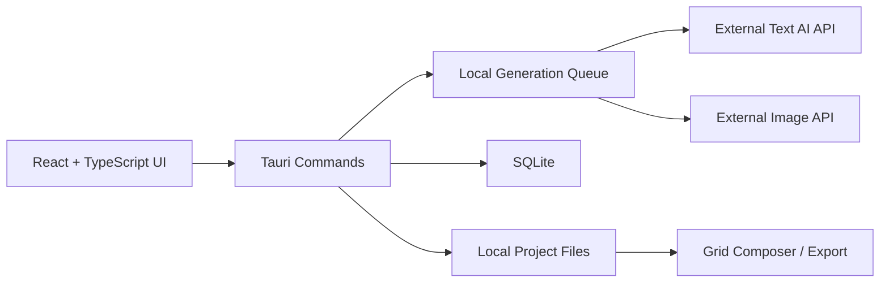

# Technical Plan

## Phase 1 Architecture



## Stack

```text
Desktop: Tauri v2
Frontend: React + TypeScript + Vite
State: Zustand
UI: Radix UI or shadcn/ui
Icons: lucide-react
Local command layer: Rust
Database: SQLite
Image processing: Rust image crate
HTTP: Rust reqwest
```

## Local Data Model

### Project

```ts
type Project = {
  id: string;
  title: string;
  originalPrompt: string;
  style: string;
  gridSize: 9 | 16 | 25;
  aspectRatio: "1:1" | "16:9" | "9:16" | "4:3";
  quality: "draft" | "standard" | "high";
  schemaVersion: number;
  createdAt: string;
  updatedAt: string;
};
```

### ImageTask

```ts
type ImageTask = {
  id: string;
  projectId: string;
  parentTaskId?: string;
  explorationRound: number;
  index: number;
  prompt: string;
  status: "pending" | "running" | "completed" | "failed" | "cancelled";
  imagePath?: string;
  errorMessage?: string;
  provider: string;
  model: string;
  createdAt: string;
  updatedAt: string;
};
```

### AppSettings

```ts
type AppSettings = {
  apiProvider: string;
  textModel: string;
  imageModel: string;
  maxConcurrency: number;
  defaultGridSize: 9 | 16 | 25;
  defaultAspectRatio: "1:1" | "16:9" | "9:16" | "4:3";
  outputDirectory?: string;
};
```

API keys should be handled separately from normal settings.

## Local Storage Layout

Recommended layout:

```text
PromptGrid/
  app.db
  projects/
    <project-id>/
      project.json
      images/
        round-001-cell-001.png
        round-001-cell-002.png
      exports/
        grid-round-001.png
```

## Provider Interface

Provider logic should be behind a boundary:

```ts
type PromptVariantProvider = {
  generateVariants(input: GenerateVariantsInput): Promise<PromptVariant[]>;
};

type ImageProvider = {
  generateImage(input: GenerateImageInput): Promise<GeneratedImage>;
};
```

Phase 1 can implement one provider first, but app code should not spread provider-specific request details across UI components.

## Queue Rules

- Each grid cell is one task.
- Default max concurrency is 3.
- Completed cells render immediately.
- Failed cells keep prompt and error.
- Retrying a cell should not reset unrelated cells.
- Regenerating a completed cell should create a new task attempt or preserve attempt metadata.
- Expanding a cell starts a new exploration round seeded by that cell prompt.

## Security Notes

- Do not log API keys.
- Do not export API keys.
- Do not store API keys inside project folders.
- Use OS-level secure storage when available.
- Keep external API calls in Tauri Rust command layer where practical.
